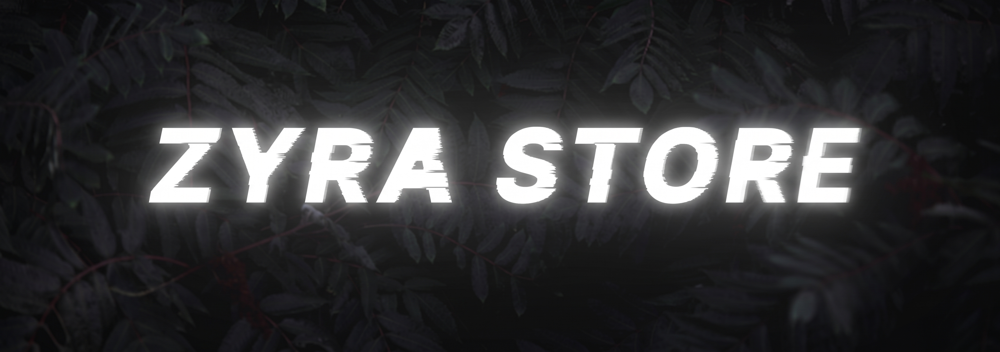

  

<h1 align="center">⚡ Zyra Store — Premium FiveM Resources</h1>
<h3 align="center">ESX • QBCore • QBox • Standalone • Next-Gen NUI Interfaces</h3>

  We design and develop high-performance FiveM scripts, custom NUI UI interfaces, and server frameworks — built with clean code, sleek aesthetics, and 24/7 dedicated support.

  
  
  
  

  

---

## 🎨 Open Source FiveM Loading Screens Collection

Free, high-performance loading screens for FiveM roleplay servers featuring particle canvas backgrounds, custom audio players, interactive news feeds, and responsive NUI design.

| Loading Screen Template | Style / Aesthetics | Key Features |
| :--- | :--- | :--- |
| ⚡ **[Zyra-Loading-Screen1](https://github.com/ZyraStore/Zyra-Loading-Screen1)** | Cyberpunk / Synthwave | Particle canvas, NUI audio equalizer, rules accordion, social grid |
| ❄️ **[Zyra-Loading-Screen2](https://github.com/ZyraStore/Zyra-Loading-Screen2)** | Neo-Glassmorphism | Translucent frosted glass UI, audio controller, news cards, rules modal |
| ✨ **[Zyra-Loading-Screen3](https://github.com/ZyraStore/Zyra-Loading-Screen3)** | Minimalist Dark Slate | Google Outfit font, smooth loading progress bar, multi-language support |
| 📜 **[Zyra-Loading-Screen4](https://github.com/ZyraStore/Zyra-Loading-Screen4)** | Cinematic Editorial | Luxury Playfair Display serif fonts, SVG radial progress circle, news slides |
| 🖥️ **[Zyra-Loading-Screen5](https://github.com/ZyraStore/Zyra-Loading-Screen5)** | Sci-Fi Tech Dashboard | Orbitron HUD elements, live system changelog, download telemetry |
| 📰 **[Zyra-Loading-Screen6](https://github.com/ZyraStore/Zyra-Loading-Screen6)** | Editorial Split-Screen | Bold Montserrat typography, ambient sound system, community highlights |
| 🌌 **[Zyra-Loading-Screen7](https://github.com/ZyraStore/Zyra-Loading-Screen7)** | Constellation HUD | Interactive starfield network, holographic overlays, streaming audio |
| 💧 **[Zyra-Loading-Screen8](https://github.com/ZyraStore/Zyra-Loading-Screen8)** | Liquid Metal Swiss | Organic mercury blob animations, Swiss minimal layout, floating cards |
| 🚀 **[Zyra-Loading-Screen9](https://github.com/ZyraStore/Zyra-Loading-Screen9)** | Hyperspace Portal | 3D warp speed particle tunnel, neon glow highlights, news drawer |

---

### 🛠️ Languages & Tech Stack

  

---

### 📬 Connect With Us
- 💬 **Discord Community:** [join.discord/ZyraStore](https://discord.gg/EbxjF6zTZP)
- 🌐 **Documentation:** [zyra-store.mintlify.site](https://zyra-store.mintlify.site/introduction)
- 📩 **Official Email:** `zyrastoretebex@gmail.com`
- ⚡ **Fun Fact:** All resources are optimized for 0.00ms idle execution and maximum FiveM performance.

---

  © 2026 Zyra Store. Released under Open Source Code license. Commercial resale strictly prohibited.

